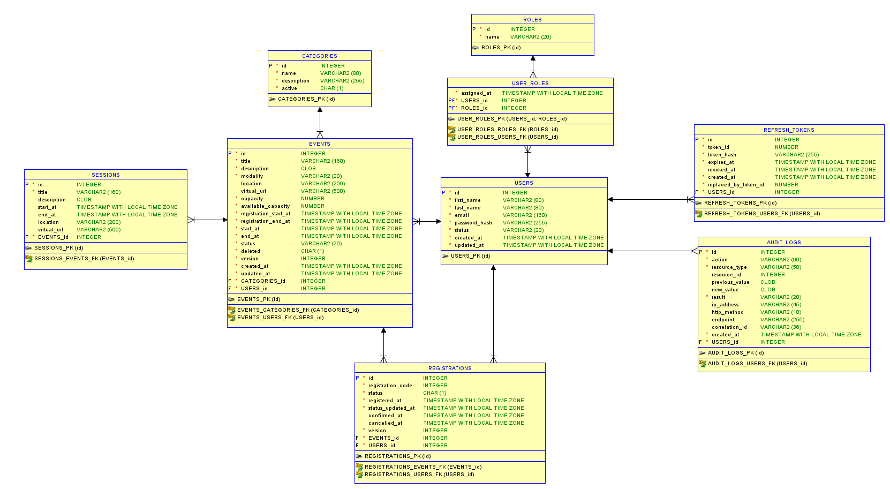
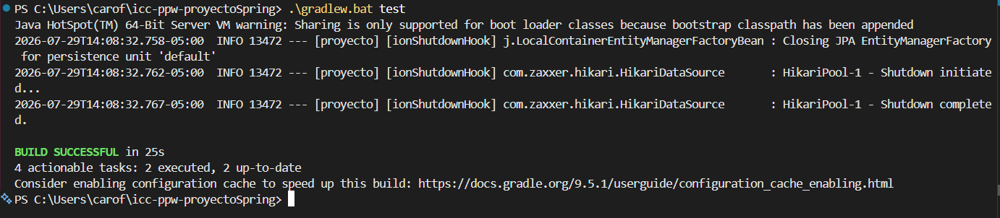

# Proyecto Final PPW 

API REST desarrollada con **Spring Boot 3 / 4**, **PostgreSQL**, **Redis** y **Spring Security con JWT**, orientada a la gestión integral de eventos académicos, inscripciones, control de roles y auditoría.

## Estudiantes:

- María Verónica Cobos Arévalo
- Dayanna Carolina Fortmann Sánchez
- Jonnathan Josué Párraga Riera


## 1.- Enlaces Públicos:

- **Backend API Base:** `https://proyecto-api-2jua.onrender.com/api`
- **Swagger UI (Documentación interactiva):** `https://proyecto-api-2jua.onrender.com/api/swagger-ui/index.html`

Credenciales de Swagger: usuario `evaluador`, contraseña (entregada por separado).

- **Actuator Health Check:** `https://proyecto-api-2jua.onrender.com/api/actuator/health`

- **Link a YouTube:**


## 2.- Arquitectura y Seguridad:

* **Autenticación:** Basada en **Stateless JWT** (Access Token de corta duración) y **Refresh Tokens** persistidos y revocables en base de datos.
* **Control de Acceso:** Basado en Roles (`ROLE_USER`, `ROLE_ORGANIZER`, `ROLE_ADMIN`) y validación de propiedad (*ownership*) para recursos creados por organizadores.
* **Protección Swagger en Producción:** La interfaz de Swagger UI está resguardada bajo **HTTP Basic Authentication** para evitar la exposición pública de la documentación.
* **Auditoría:** Registro asíncrono y desacoplado de operaciones (`SUCCESS` / `FAILED`) capturando IP origen, método HTTP, URI y `X-Correlation-Id`.

## 3.- Modelo de Base de Datos y Migraciones:

El proyecto utiliza **Flyway** para la gestión del esquema de la base de datos y la inserción de datos iniciales.

### Diagrama Entidad-Relación:



### Credenciales de Prueba:

Insertados automáticamente desde la migración inicial (`V1__initial_schema_and_data.sql`):

| Rol | Email | Contraseña |
|---|---|---|
| **Administrador** | `admin@academic.test` | `Admin123*` |
| **Organizador** | `maria.cordero@academic.test` | `Password123*` |
| **Participante** | `carlos.velez@academic.test` | `Password123*` |


## 4.- Variables de Entorno Requeridas:

Consulta el archivo `.env.example` en la raíz del proyecto para el listado completo.

| Variable | Descripción | Origen / Ámbito |
|---|---|---|
| `PORT` | Puerto de escucha del servidor embebido. | Automático / Local (8080) |
| `DB_URL` | Cadena JDBC de PostgreSQL (`jdbc:postgresql://host:port/db`). | Manual / Render |
| `DB_USERNAME` | Usuario de la base de datos. | Variable de entorno |
| `DB_PASSWORD` | Contraseña de la base de datos. | Variable de entorno |
| `REDIS_URL` | Cadena de conexión a Redis (Rate Limiting y Login Lockout). | Key Value Store |
| `JWT_SECRET` | Clave secreta para la firma HS384 (Mínimo 384 bits / 48 caracteres). | Variable de entorno |
| `JWT_ACCESS_EXPIRATION` | Expiración del Access Token en milisegundos (ej: `900000`). | Fijo |
| `JWT_REFRESH_EXPIRATION` | Expiración del Refresh Token en ms (ej: `604800000`). | Fijo |
| `ALLOWED_ORIGINS` | Dominios habilitados para CORS. | Configuración web |
| `SWAGGER_USER` | Usuario de acceso a Swagger UI en perfil `prod`. | Seguridad Basic Auth |
| `SWAGGER_PASSWORD` | Contraseña de acceso a Swagger UI en perfil `prod`. | Seguridad Basic Auth |


## 5.- Ejecución en Entorno Local

### Requisitos previos
* Java 22 LTS
* Docker & Docker Compose

### 1. Clonar el repositorio y configurar variables
```bash
git clone [https://github.com/tu-usuario/tu-repositorio.git](https://github.com/tu-usuario/tu-repositorio.git)
cd tu-repositorio
cp .env.example .env
```

### 2. Levantar la infraestructura (PostgreSQL & Redis)

```bash 
docker compose up -d
```

### 3. Ejecutar la aplicación con Gradle

```bash 
# En Windows (PowerShell)
.\gradlew.bat bootRun

# En Linux / macOS
./gradlew bootRun
```

Con esto la API estará lista en `http://localhost:8080/api`

### 4. Construir y Ejecutar con Docker

```bash 
docker build -t proyecto-api .

docker run --rm -p 8080:8080 `
  -e SPRING_PROFILES_ACTIVE=prod `
  -e PORT=8080 `
  -e DB_URL="jdbc:postgresql://host.docker.internal:5432/academic_events_db" `
  -e DB_USERNAME=ups `
  -e DB_PASSWORD=ups123 `
  -e REDIS_URL="redis://host.docker.internal:6379" `
  -e JWT_SECRET="<clave-local-de-prueba-de-al-menos-48-caracteres>" `
  -e JWT_ACCESS_EXPIRATION=900000 `
  -e JWT_REFRESH_EXPIRATION=604800000 `
  -e ALLOWED_ORIGINS="http://localhost:5173" `
  -e SWAGGER_USER=evaluador `
  -e SWAGGER_PASSWORD="<clave-local-de-prueba>" `
  proyecto-api
```

## 6.- Tests y verificaciones

### 1. Pruebas Unitarias (`/test`)

```bash 
.\gradlew.bat test
```

Lo que debería salir:



### 2. Cliente de Prueba - Postman

Dentro de `/postman` del repositorio encontrarás el archivo de colección listo para importar:
```bash 
academic-events-api.postman_collection.json
```

Incluye variables de entorno preconfiguradas para alternar fácilmente entre los entornos Local y Render.